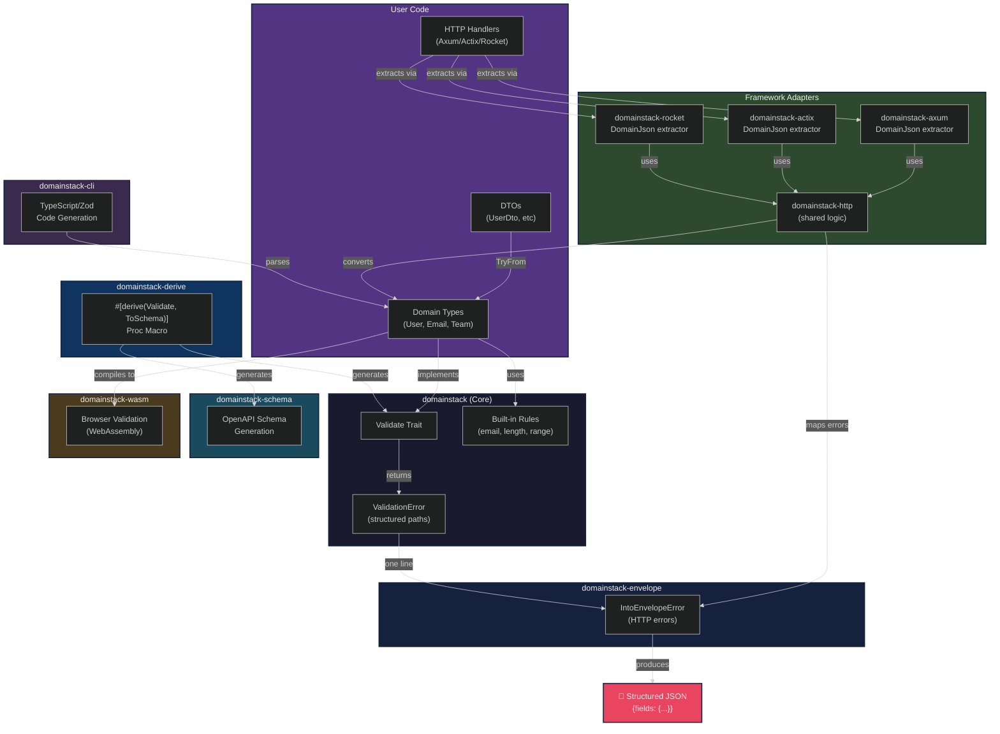

# Architecture

Technical architecture of the domainstack validation framework.

## System Overview



## Component Architecture

### Core Library (domainstack)

**Purpose**: Foundational validation primitives

**Key Types**:
- `Validate` trait - Core validation interface
- `Rule<T>` - Type-safe validation rules
- `ValidationError` - Structured error collection
- `Path` - Field path construction
- `Violation` - Single validation failure

**Zero Dependencies**: Only uses `std` (regex optional for email)

**Design Principles**:
- Composable rules via `and()`, `or()`, `when()`
- Type safety - Rule<T> ensures type correctness
- Structured paths - Never use string formatting
- Framework agnostic - No web framework dependencies

### Derive Macro (domainstack-derive)

**Purpose**: Code generation for common validation patterns

**Technology**: Procedural macro using `syn`, `quote`, `proc-macro2`

**Attributes Supported**:
1. `#[validate(length(min, max))]` - String length
2. `#[validate(range(min, max))]` - Numeric range
3. `#[validate(nested)]` - Nested struct validation
4. `#[validate(each(...))]` - Collection validation
5. `#[validate(custom = "fn")]` - Custom validation functions

**Code Generation Strategy**:
- Generates `impl Validate for Type` at compile time
- Uses structured Path API (not string concatenation)
- Applies `.prefixed()` for nested/collection paths
- Integrates with core Rule<T> system

### HTTP Integration (domainstack-envelope)

**Purpose**: Bridge validation errors to HTTP responses

**Integration**: error-envelope crate (framework-agnostic)

**API**: `IntoEnvelopeError` trait with one method

**Error Format**:
```json
{
  "code": "VALIDATION",
  "status": 400,
  "retryable": false,
  "details": {
    "fields": {
      "path.to.field": [
        {"code": "error_code", "message": "...", "meta": {...}}
      ]
    }
  }
}
```

**Design Decision**: Trait instead of `From` to avoid orphan rule issues

### Schema Generation (domainstack-schema)

**Purpose**: Generate OpenAPI schemas from validation rules

**Key Types**:
- `Schema` - OpenAPI schema builder
- `ToSchema` trait - Derive macro for schema generation
- `OpenAPIBuilder` - Document assembly

**Integration**: Schemas reflect validation constraints (min/max, patterns, enums)

**Design Decision**: Same derive macro generates both validation AND schema

### Browser Validation (domainstack-wasm)

**Purpose**: Run identical validation in browser via WebAssembly

**Key Features**:
- Zero drift - same Rust code, compiled to WASM
- Type registry for runtime type dispatch
- JSON-based API for JavaScript interop
- ~60KB bundle size

**API**:
```javascript
const validator = createValidator();
const result = validator.validate('User', jsonString);
```

**Design Decision**: Same validation errors in browser and server

### Code Generation CLI (domainstack-cli)

**Purpose**: Generate TypeScript/Zod schemas from Rust types

**Capabilities**:
- Parse Rust source files for `#[derive(Validate)]`
- Generate Zod schemas with matching constraints
- TypeScript type generation

**Usage**:
```bash
domainstack-cli generate --input src/ --output schemas.ts
```

**Design Decision**: Source-level parsing, not runtime reflection

## Data Flow

### 1. Domain Type Definition

```rust
#[derive(Validate)]
struct User {
    #[validate(length(min = 1, max = 50))]
    name: String,
}
```

### 2. Macro Expansion (Compile Time)

The derive macro generates:

```rust
impl Validate for User {
    fn validate(&self) -> Result<(), ValidationError> {
        let mut err = ValidationError::new();
        
        let rule = domainstack::rules::min_len(1)
            .and(domainstack::rules::max_len(50));
        if let Err(e) = domainstack::validate("name", self.name.as_str(), &rule) {
            err.extend(e);
        }
        
        if err.is_empty() { Ok(()) } else { Err(err) }
    }
}
```

### 3. Validation Execution (Runtime)

```rust
let user = User { name: "".to_string() };
let result = user.validate();
// Err(ValidationError {
//     violations: vec![
//         Violation {
//             path: Path("name"),
//             code: "min_length",
//             message: "Must be at least 1 characters",
//             meta: Meta { min: "1" }
//         }
//     ]
// })
```

### 4. HTTP Conversion

```rust
result.map_err(|e| e.into_envelope_error())?;
// Error {
//     code: Code::Validation,
//     status: 400,
//     message: "Validation failed: Must be at least 1 characters",
//     details: Some({ "fields": { "name": [...] } })
// }
```

### 5. JSON Serialization

```json
{
  "code": "VALIDATION",
  "status": 400,
  "message": "Validation failed: Must be at least 1 characters",
  "details": {
    "fields": {
      "name": [
        {
          "code": "min_length",
          "message": "Must be at least 1 characters",
          "meta": {"min": "1"}
        }
      ]
    }
  }
}
```

## Path Construction

### Structured Path API

Paths are built using a fluent API, never string formatting:

```rust
// Simple field
Path::root().field("email")                    // "email"

// Nested fields
Path::root()
    .field("guest")
    .field("email")
    .field("value")                            // "guest.email.value"

// Collection indices
Path::root()
    .field("rooms")
    .index(0)
    .field("adults")                           // "rooms[0].adults"
```

**Why Structured?**
- Type-safe construction
- Consistent formatting
- Easy to transform (`.prefixed()`)
- No string interpolation errors

## Rule Composition

### Rule<T> Design

```rust
pub struct Rule<T: ?Sized + 'static> {
    check: Box<dyn Fn(&T) -> Result<(), Violation> + 'static>,
}
```

**Key Design Decisions**:
- `T: ?Sized` - Supports both `String` and `str`
- `'static` - Rules can be stored and reused
- Boxed function - Enables composition
- Type parameter - Ensures type safety

### Composition Pattern

```rust
impl<T> Rule<T> {
    pub fn and(self, other: Rule<T>) -> Rule<T> { ... }
    pub fn or(self, other: Rule<T>) -> Rule<T> { ... }
    pub fn when(self, predicate: impl Fn(&T) -> bool) -> Rule<T> { ... }
}
```

**Example**:
```rust
let rule = min_len(5)          // Rule<str>
    .and(max_len(255))         // Rule<str>
    .and(email());             // Rule<str>
```

All rules type-check at compile time!

## Error Accumulation

### ValidationError Pattern

```rust
let mut err = ValidationError::new();

// Collect multiple violations
if let Err(e) = validate_field_1() {
    err.extend(e);
}
if let Err(e) = validate_field_2() {
    err.extend(e);
}

// Return all or nothing
if err.is_empty() { Ok(()) } else { Err(err) }
```

**Benefits**:
- Reports all errors at once (not just first failure)
- Better UX - users see all problems
- Efficient - single validation pass

### Nested Error Prefixing

```rust
// Validate nested struct
if let Err(e) = self.email.validate() {
    err.merge_prefixed("email", e);
}
// Errors from email become "email.value", "email.domain", etc.
```

The `.prefixed()` method transforms all error paths.

## Proc Macro Implementation

### Attribute Parsing

Uses `syn` to parse attributes:

```rust
#[validate(length(min = 1, max = 50))]
```

Parsed into:
```rust
ValidationRule::Length {
    min: Some(1),
    max: Some(50),
    code: None,
    message: None,
}
```

### Code Generation

Uses `quote!` macro to generate implementation:

```rust
quote! {
    impl domain stack::Validate for #struct_name {
        fn validate(&self) -> Result<(), domainstack::ValidationError> {
            let mut err = domainstack::ValidationError::new();
            #(#field_validations)*
            if err.is_empty() { Ok(()) } else { Err(err) }
        }
    }
}
```

## Design Decisions

### 1. Framework-Agnostic Core

**Decision**: Core library has zero web dependencies  
**Rationale**: Domain logic should be independent of HTTP framework  
**Benefit**: Works with Axum, Actix, Warp, or any other framework

### 2. Separate Integration Crates

**Decision**: HTTP integration in separate crate (domainstack-envelope)  
**Rationale**: Users can choose their integration layer  
**Benefit**: Core remains lightweight, integrations are opt-in

### 3. Derive Macro Optional

**Decision**: Derive macro is a feature flag  
**Rationale**: Some users prefer manual control  
**Benefit**: Minimal dependencies for simple use cases

### 4. Structured Paths Over Strings

**Decision**: Path is a type, not a String  
**Rationale**: Type-safe construction, consistent formatting  
**Benefit**: No string interpolation bugs, easy to transform

### 5. Reference Rules (&Rule<T>)

**Decision**: validate() accepts `&Rule<T>` not `Rule<T>`  
**Rationale**: Better error spans in generated code  
**Benefit**: Compiler errors point to actual validation rules

## Performance Characteristics

### Validation Cost

- **String rules**: O(n) where n = string length
- **Numeric rules**: O(1) comparisons
- **Nested validation**: Sum of child validation costs
- **Collection validation**: O(n × validation_cost) where n = collection size

### Memory Allocation

- ValidationError uses `Vec<Violation>` - grows as needed
- Path segments allocated per error
- Meta fields allocated per violation
- Zero-copy where possible (borrows data)

### Compile-Time Optimization

- Derive macro generates specialized code per type
- No runtime reflection
- Rules are inlined where possible
- Type checking at compile time

## See Also

- [Core Concepts](./CORE_CONCEPTS.md) - Foundation principles
- [Rules Reference](./RULES.md) - All validation rules
- [OpenAPI Schema](./OPENAPI_SCHEMA.md) - Schema generation guide
- [WASM Validation](./WASM_VALIDATION.md) - Browser validation guide
- [Source Code](../domainstack/) - Implementation
